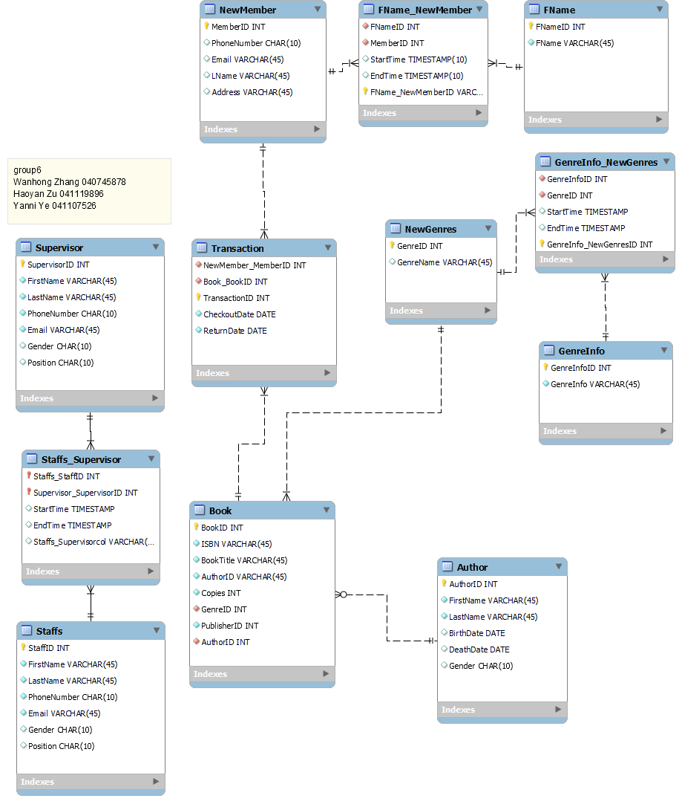
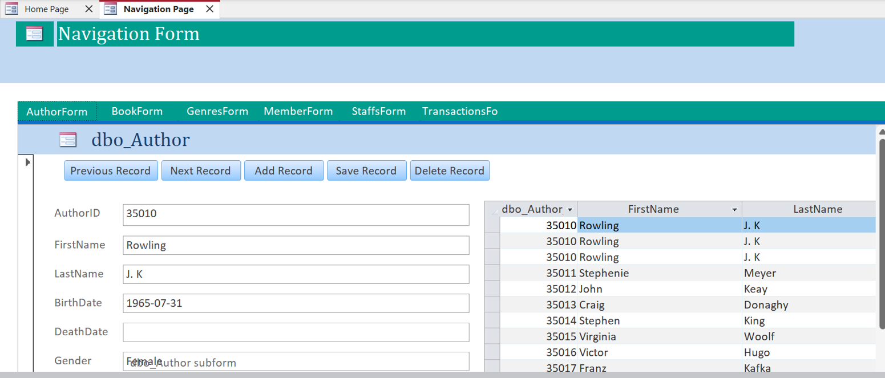
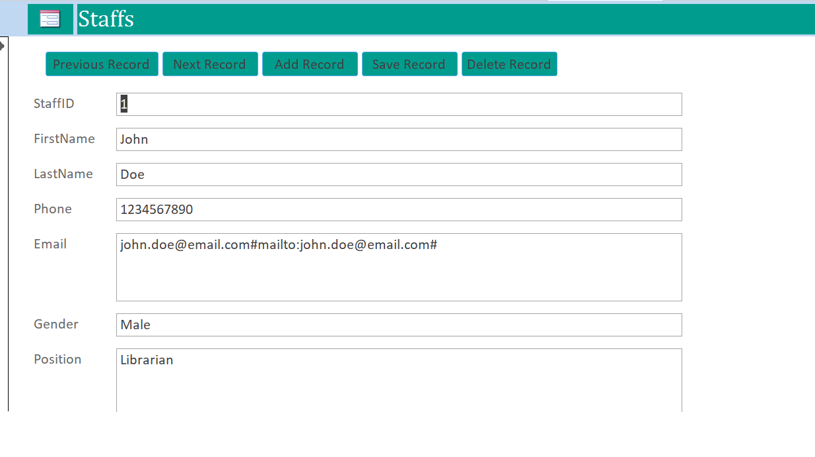
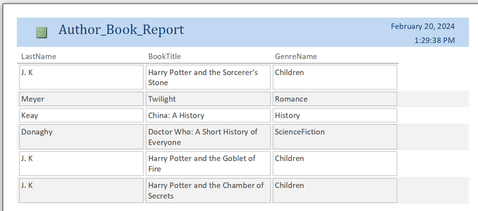
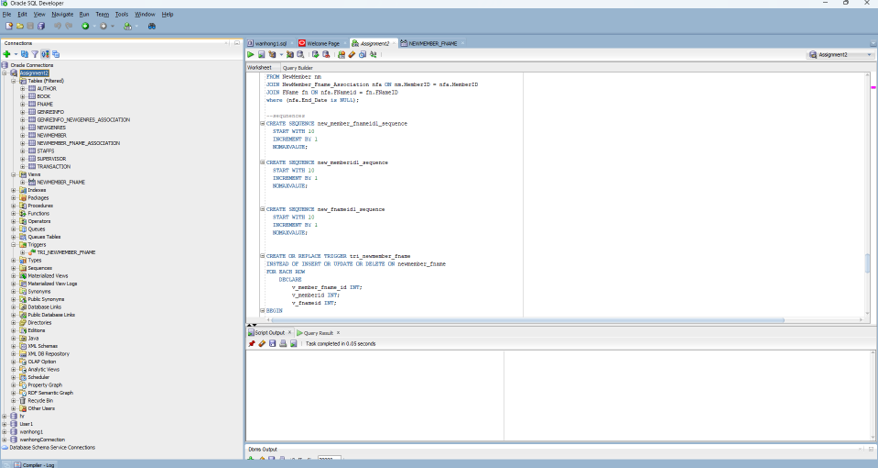

# Library-Database
✨ Build a library management system with Access and Oracle database.

## Description
The Library Service Management System is a meticulously crafted database application designed to enhance the management of library services. Tailored for efficiency, it facilitates the tracking of transactions, customer information, and employee management within a library setting.

## Main Features
### Tables

1.	FName Table: Stores first names with a unique identifier (FNameID) as the primary key.
2.	NewMember Table: Contains information about new members, including MemberID, PhoneNumber, Email, Last Name (LName), and Address.
3.	NewMember_Fname_Association Table: Manages the association between new members and first names.
4.	NewGenres Table: Stores information about new genres, with GenreID as the primary key and GenreName as the genre's name.
5.	GenreInfo Table: Holds details about genre information.
6.	GenreInfo_NewGenres_Association Table: Manages the association between genre information and new genres.
7.	Author Table: Stores author details such as AuthorID, FirstName, LastName, BirthDate, DeathDate, and Gender.
8.	Book Table: Contains information about books, including BookID, ISBN, BookTitle, AuthorID, Copies, GenreID, and PublisherID.
9.	Transaction Table: Tracks transactions related to book checkout and return.
10.	Supervisor Table: Stores supervisor details like SupervisorID, FirstName, LastName, PhoneNumber, Email, Gender, and Position.
11.	Staffs Table: Contains information about staff members.

### Benefits
1.	Easier tracking of books and inventory.
2.	Streamlines transaction management.
3.	Facilitates quick and easy access to member and book information.
### Intended Users
All library members.

## Front End
We utilize Access for front-end development to craft interactive pages, created elements such as tables, forms, reports, and more. Our connection to the back-end database is facilitated through ODBC.

## Back End
For the backend, we rely on Oracle to manage the library database, employing triggers and sequences to update the interface dynamically. Staff members can utilize the frontend to add, modify, or delete data for all customers.

